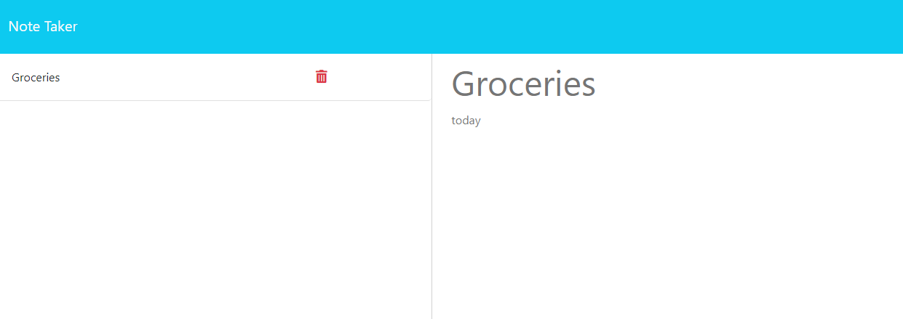

# note-taker
app to take notes

  

  

  ## Site Link
  https://note-taker-hok4.onrender.com/notes 

  ## Description
  This project is a simple note taker. It's main purpose is to allow users to write note reminders for tasks they have to do.

  ## Table of Contents
  - [Installation](#installation)
  - [Usage](#usage)
  - [License](#license)

  
  

  ## Usage
  Type a note title and body into their respective text fields and click save note in the upper right to store the note in the side bar on the left. To display a stored note click on it in the sidebar. To delete a note click on the red trashcan icon next to the stored note.

  ## License
    This README generator is licensed under the [MIT License](https://opensource.org/licenses/MIT)
  

  ## Badges
  

  ## Contribute
  

  ## Tests
  

  ## Questions
  Feel free to reach out and contact me with any questions you may have.
  - GitHub: [KyleH-Git](https://github.com/KyleH-Git)
  - Email: dahaydnator@gmail.com
